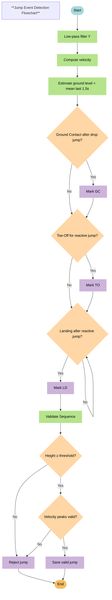

```mermaid
flowchart TB
    Title["**Jump Event Detection Flowchart**"]:::title
A([Start]):::start --> B[Low-pass filter Y]:::process
    B --> C[Compute velocity]:::process
    C --> D[Estimate ground level = mean last 1.5s]:::process

    D --> E{Ground Contact after drop jump?}:::decision
    E -->|Yes| F[Mark GC]:::event
    E -->|No| G

    F --> G{Toe-Off for reactive jump?}:::decision
    G -->|Yes| H[Mark TO]:::event
    G -->|No| I

    H --> I{Landing after reactive jump?}:::decision
    I -->|Yes| J[Mark LD]:::event
    I -->|No| I

    J --> K[Validate Sequence]:::process
    K --> L{Height ≥ threshold?}:::decision
    L -->|Yes| M{Velocity peaks valid?}:::decision
    L -->|No| X[Reject jump]:::event
    M -->|Yes| N[Save valid jump]:::event
    M -->|No| X
    X --> O([End]):::endNode
    N --> O

    classDef start fill:#A8DADC,stroke:none,color:#000
    classDef endNode fill:#F6BD60,stroke:none,color:#000
    classDef process fill:#B5E48C,stroke:none,color:#000
    classDef decision fill:#FFD6A5,stroke:none,color:#000
    classDef event fill:#CDB4DB,stroke:none,color:#000
```