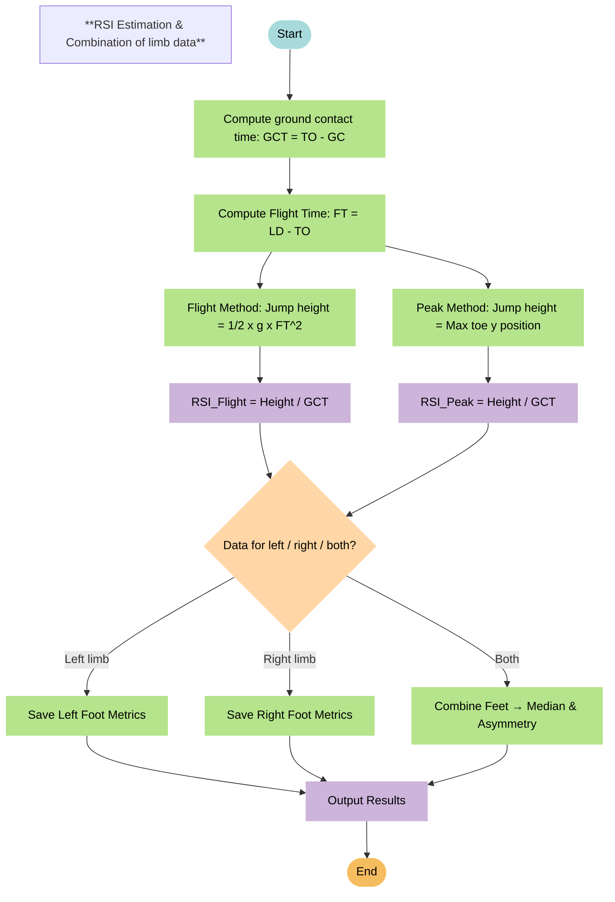

```mermaid
flowchart TB
    Title["**RSI Estimation & Combination of limb data**"]:::title
    A([Start]):::start --> B[Compute ground contact time: GCT = TO - GC]:::process
    B --> C[Compute Flight Time: FT = LD - TO]:::process
    C --> D[Flight Method: Jump height = 1/2 x g x FT^2]:::process
    C --> E[Peak Method: Jump height = Max toe y position]:::process
    D --> F[RSI_Flight = Height / GCT]:::event
    E --> G[RSI_Peak = Height / GCT]:::event

    F --> H{Data for left / right / both?}:::decision
    G --> H
    H -->|Left limb| I[Save Left Foot Metrics]:::process
    H -->|Right limb| J[Save Right Foot Metrics]:::process
    H -->|Both| K[Combine Feet → Median & Asymmetry]:::process
    I --> L[Output Results]:::event
    J --> L
    K --> L
    L --> M([End]):::endNode

    classDef start fill:#A8DADC,stroke:none,color:#000
    classDef endNode fill:#F6BD60,stroke:none,color:#000
    classDef process fill:#B5E48C,stroke:none,color:#000
    classDef decision fill:#FFD6A5,stroke:none,color:#000
    classDef event fill:#CDB4DB,stroke:none,color:#000
```