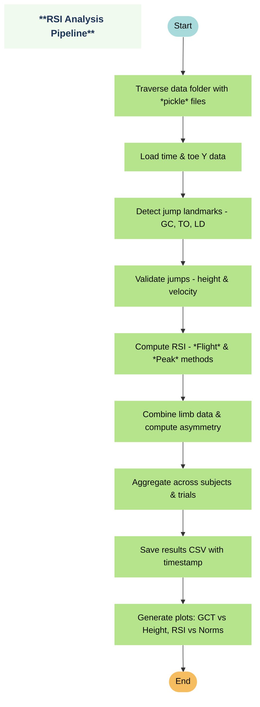

```mermaid
flowchart TB
    Title["**RSI Analysis Pipeline**"]:::title

    A([Start]):::start --> B[Traverse data folder with *pickle* files]:::process
    B --> C[Load time & toe Y data]:::process
    C --> D[Detect jump landmarks - GC, TO, LD]:::process
    D --> E[Validate jumps - height & velocity]:::process
    E --> F[Compute RSI - *Flight* & *Peak* methods]:::process
    F --> G[Combine limb data & compute asymmetry]:::process
    G --> H[Aggregate across subjects & trials]:::process
    H --> I[Save results CSV with timestamp]:::process
    I --> J[Generate plots: GCT vs Height, RSI vs Norms]:::process
    J --> K([End]):::endNode

    classDef title fill:#F1FAEE,stroke:none,color:#1D3557,font-size:18px,font-weight:bold
    classDef start fill:#A8DADC,stroke:none,color:#000
    classDef endNode fill:#F6BD60,stroke:none,color:#000
    classDef process fill:#B5E48C,stroke:none,color:#000
```